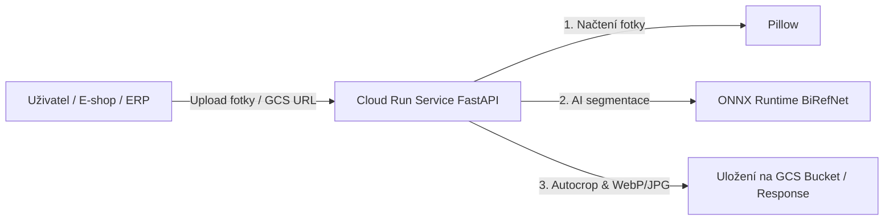

# ☁️ Analýza nasazení a nákladů: Google Cloud Run

Tento dokument obsahuje technickou a nákladovou analýzu nasazení systému pro odstranění pozadí a inteligentní ořezávání obrázků na platformu **Google Cloud Run**.

---

## 🏗️ 1. Doporučená architektura

Google Cloud Run představuje plně spravovanou bezserverovou (serverless) platformu, kde se platí **pouze za přesný čas výpočtu** (na milisekundy přesně). Pokud nepřichází žádné požadavky, služba škáluje na 0 instancí (náklady = 0 Kč).

### Možné režimy provozu:
1. **Cloud Run Service (HTTP REST API):**
   - Vhodné pro **interaktivní požadavky v reálném čase** (např. FastAPI endpoint `POST /api/v1/crop-background`, kam e-shop nahraje fotku a za 1–2 s dostane oříznutý WebP).
2. **Cloud Run Jobs (Dávkové zpracování):**
   - Vhodné pro **hromadné úlohy** (např. noční dávka, která paralelně zpracuje 10 000 fotek z Google Cloud Storage bucketu).

---

## ⚙️ 2. Doporučená hardwarová konfigurace

- **vCPU:** `4 vCPU` (ONNX Runtime efektivně paralelizuje maticové výpočty na všechna dostupná jádra).
- **RAM:** `4 GiB` (dostatečná rezerva pro model `birefnet-general` i velké fotografie ve vysokém rozlišení).
- **Concurrency:** `1` (pro maximální výkon AI modelu je ideální 1 request na kontejner).
- **Průměrná doba zpracování 1 fotky (1000×1000 px):** cca **`1.5 – 2.0 s`** na 4 vCPU.

---

## 💰 3. Cenový model Google Cloud Run

Google Cloud Run poskytuje každý měsíc bezplatný balíček (**Free Tier**):
- **180 000 vCPU-sekund** měsíčně ZDARMA.
- **360 000 GiB-sekund** měsíčně ZDARMA.
- **2 000 000 requestů** měsíčně ZDARMA.

### Náklady na 1 obrázek (při překročení Free Tieru):
- **vCPU náklad (4 vCPU po dobu 2 s):** $8 \text{ vCPU-s} \times \$0.000024 = \$0.000192$
- **RAM náklad (4 GiB po dobu 2 s):** $8 \text{ GiB-s} \times \$0.0000025 = \$0.000020$
- **Request náklad:** $< \$0.000001$
- **Celkem za 1 obrázek:** **~$0.00021 USD (cca 0,005 Kč / fotka)**

---

## 📈 4. Škálování a celkové náklady

| Objem obrázků | Čas běhu (4 vCPU) | Cena v rámci Free Tier | Cena bez Free Tier (USD) | Cena v CZK |
| :--- | :--- | :--- | :--- | :--- |
| **Desítky (50 fotek)** | ~100 sekund | **0,00 Kč** (ZDARMA) | $0.01 USD | cca 0,25 Kč |
| **Stovky (500 fotek)** | ~1 000 sekund | **0,00 Kč** (ZDARMA) | $0.11 USD | cca 2,50 Kč |
| **1 000 fotek** | ~2 000 sekund | **0,00 Kč** (ZDARMA)* | **$0.21 USD** | **cca 5 Kč** |
| **10 000 fotek** | ~20 000 sekund | cca 25 Kč | **$2.10 USD** | **cca 50 Kč** |
| **100 000 fotek** | ~200 000 sekund | cca 450 Kč | **$21.00 USD** | **cca 500 Kč** |

*\* Poznámka: 1 000 fotek spotřebuje pouze ~8 000 z 180 000 bezplatných vCPU-sekund, takže se kompletně vejde do Free Tieru.*

---

## 🥊 Srovnání s komerčními API službami

| Poskytovatel | 1 000 fotek | 10 000 fotek | Bezpečnost a soukromí |
| :--- | :--- | :--- | :--- |
| **Remove.bg API** | ~$199 USD (~4 700 Kč) | ~$1 790 USD (~42 000 Kč) | Data opouští firmu k 3. straně |
| **PhotoRoom API** | ~$100 USD (~2 400 Kč) | ~$800 USD (~19 000 Kč) | Data opouští firmu k 3. straně |
| **Vlastní Cloud Run** | **~$0.21 USD (~5 Kč)** | **~$2.10 USD (~50 Kč)** | **100% privátní infrastruktura v GCP** |

> **Závěr:** Vlastní řešení na Google Cloud Run přináší **úsporu přes 99.8 % nákladů** a plnou kontrolu nad daty.

---

## 🛠️ 5. Doporučené best practices pro Docker & GCP

1. **Předstažení modelu (Bake-in do Docker Image):**
   V `Dockerfile` stáhnout soubor `birefnet-general.onnx` přímo během sestavování (`docker build`). Tím se zabrání stahování 970MB modelu při studeném startu kontejneru.
2. **Škálování na 0 (`min-instances = 0`):**
   Při nulovém provozu neběží žádné servery a náklady jsou 0 Kč.
3. **Integrace s Google Cloud Storage (GCS):**
   Pro zpracování velkých dávek je nejlepší předávat pouze URI souborů v bucketu (`gs://bucket/input.jpg` $\to$ `gs://bucket/output.webp`). Přenos dat v rámci stejného GCP regionu je zdarma a extrémně rychlý.
