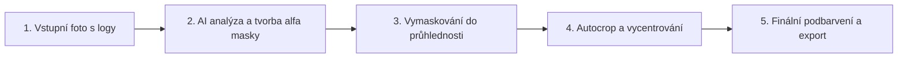

# 🖼️ Image Cropping & Background Removal

Automatické odstranění pozadí, smazání rušivých log a vodoznaků na stěně, podbarvení (bílá, barvy, průhlednost), inteligentní ořez (autocrop) na poměr stran (1:1 pro e-shopy) a podrobný monitoring s rotací logů.

---

## 🧠 Jak celý proces funguje (princip v 5 krocích)

Odstranění pozadí nestojí na pouhém filtrování barev (protože autodíl má bílý štítek s kódem a odlesky). Místo toho využívá **lokální neuronovou síť pro sémantickou segmentaci** (`BiRefNet` / `U2-Net`).



1. **Načtení a předzpracování (Pillow):** Načte JPEG/PNG a připraví matici pixelů pro model.
2. **AI Segmentace popředí (BiRefNet):** Neuronová síť detekuje fyzický objekt (autodíl) a odliší ho od stěny s nápisy a logy. Výstupem je přesná černobílá **alfa maska**.
3. **Vymaskování do průhlednosti:** Maska se aplikuje na obrázek $\to$ pozadí s logy se stane 100% průhledným (RGBA).
4. **Inteligentní ořez (Autocrop & Bounding Box):** Spočítá rozměry objektu, přidá definovaný padding a vycentruje na požadovaný poměr stran (např. 1:1).
5. **Finální podbarvení a export:** Podloží čistou bílou / barevnou vrstvu a uloží jako WebP, JPEG nebo PNG.

---

## 🚀 Instalace a spuštění

### 1. Příprava virtuálního prostředí (jednorázově)
```bash
python3 -m venv .venv
.venv/bin/pip install --upgrade pip
.venv/bin/pip install -r requirements.txt
```

### 2. Spuštění skriptu

#### Možnost A: Přes aktivaci prostředí (doporučeno)
```bash
source .venv/bin/activate
python3 main.py
```

#### Možnost B: Přímo přes cestu k Pythonu z `.venv`
```bash
.venv/bin/python3 main.py
```

---

## 📁 Vygenerované výstupy (ve složce `output/`)

- **`output_white.webp`** – moderní vysoce komprimovaný formát s bílým pozadím (~22 KB).
- **`output_white.jpg`** – čisté bílé pozadí pro e-shopy (~34 KB).
- **`output_transparent.png`** – bezeztrátový PNG s alfa průhledností (~205 KB).
- **`output_autocrop_square.png`** – vycentrovaný čtvercový ořez 1:1.
- **`monitoring_YYYYMMDD_HHMMSS.log`** – logy s výsledky měření času a statistikami.

---

## 🛠️ Příklady použití v Pythonu

### 1. Základní odstranění log a sjednocení na bílé pozadí (WebP / JPG)
```python
from cropper import process_background

# Uložení do WebP s bílým pozadím a kvalitou 90 %
image, metrics = process_background(
    input_path="img-src.jpg",
    output_path="output/vysledek.webp",
    bg_color=(255, 255, 255, 255),
    model_name="birefnet-general",
    quality=90
)

print(f"Hotovo za {metrics.total_time:.2f} s (AI model: {metrics.inference_time:.2f} s)")
```

### 2. Inteligentní autocrop (čtverec 1:1 pro produktový katalog)
```python
from cropper import process_background

process_background(
    input_path="img-src.jpg",
    output_path="output/produkt_ctverec.jpg",
    bg_color=(255, 255, 255, 255),
    autocrop=True,
    padding=30,             # 30px okraj kolem dílu
    aspect_ratio=(1, 1),    # čtvercový formát
    quality=90
)
```

### 3. Dávkové zpracování 1..N obrázků s monitoringem a rotací logů
```python
from cropper import process_batch

seznam_fotek = ["foto1.jpg", "foto2.jpg", "foto3.jpg"]

stats = process_batch(
    images=seznam_fotek,
    output_dir="output/batch",
    output_format="webp",
    bg_color=(255, 255, 255, 255),
    model_name="birefnet-general",
    autocrop=True,
    padding=20,
    aspect_ratio=(1, 1),
    save_log=True,
    max_log_history=2       # Rotace: ponechá vždy max 2 nejnovější monitoring logy
)

print(f"Průměrný čas: {stats.avg_time_per_image:.2f} s/obrázek")
print(f"Rychlost: {stats.throughput_per_sec * 60:.1f} obrázků/minutu")
```

---

## 📋 Monitoring logy a automatická rotace

Při každém běhu se do složky `output/` ukládá podrobný časový report:
`output/monitoring_YYYYMMDD_HHMMSS.log`

Mechanismus rotace automaticky uchovává **vždy pouze poslední 2 nejnovější logy**, zatímco starší automaticky maže.

```text
======================================================================
📋 MONITORING LOG ZPRACOVÁNÍ OBRÁZKŮ
Čas spuštění: 2026-08-27 20:47:07
======================================================================

--- DETAILNÍ PŘEHLED JEDNOTLIVÝCH POLOŽEK ---
[001] img-src.jpg -> output_white.jpg  | Rozlišení: 1000x1000 | Celkem: 24.570s (AI: 17.263s, Ořez: 0.0858s, Uložení: 0.0596s)
[002] img-src.jpg -> output_white.webp | Rozlišení: 1000x1000 | Celkem: 26.069s (AI: 25.842s, Ořez: 0.0308s, Uložení: 0.1839s)

=================================================================
📊 SOUHRN MĚŘENÍ ČASU ZPRACOVÁNÍ
=================================================================
Celkem obrázků:          2 (Úspěšně: 2, Selhalo: 0)
Celkový čas dávky:       50.64 s
Průměrný čas na obrázek: 25.32 s
Nejrychlejší obrázek:    24.57 s
Nejpomalejší obrázek:    26.07 s
Průchodnost:             0.04 obr/s (cca 2.4 obr/min)
=================================================================
```

---

## 🧪 Spuštění unit testů
```bash
.venv/bin/python3 -m unittest discover tests
```

## Experiment: ACI watermark inpainting

[`scripts/try_aci_lama.py`](scripts/try_aci_lama.py) runs a pinned LaMa ONNX model on ACI photos with a fixed watermark mask. Setup, example command and findings from 20 sample photos are in [`experiments/README.md`](experiments/README.md).
